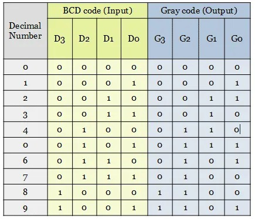
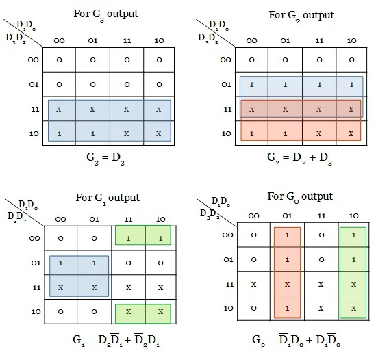
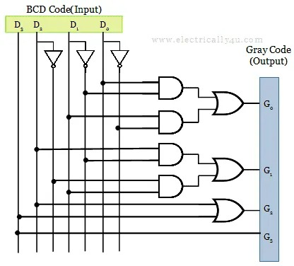
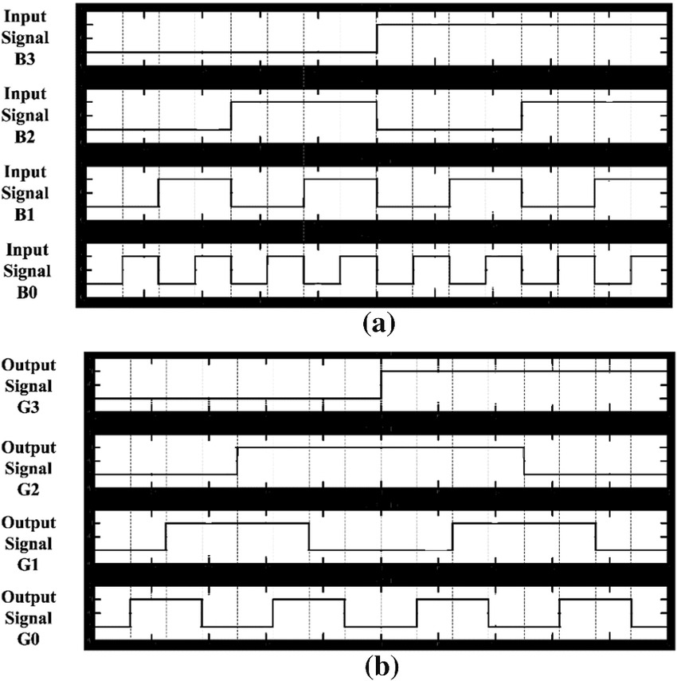

# bcdtograyconvertor
# TITLE

bcd to gray convertor using verilog

# AIM
 
 To design and simulate BCD to gray converter using Verilog.

# INTRODUCTION


The truth table having the conversion from BCD code to gray code is shown below. Since the BCD code has only 4 bits, a total of 9 BCD digits have been considered. The output is unpredictable for other input combinations.

# Truth table for BCD code to Gray code conversion




From the minterms of each output G3, G2, G1, G0, the karnaugh map is implemented to simplify the function.

# K-map simplification

The code converter circuit for BCD to gray code is drawn as below from the obtained expression.




# PROCEDURE
```
create a project with required entities
craete a module
run the module
create university program for timing diagram
give the respective inputs for timing diagram and obtain the results.

```

# PROGRAM
Developed by T.LISIANA
Reg No:22006964
```
module bgc(b,g);
input [3:0]b;
output [3:0]g;

assign g[3]=b[3];
assign g[2]=b[3]^b[2];
assign g[1]=b[2]^b[1];
assign g[0]=b[1]^b[0];

endmodule
```

# LOGIC DIAGRAM




# TIMING DIAGRAM




# RESLUTS
 Thus the implementaion of BCD to gray converter using Verilog is obtained.
